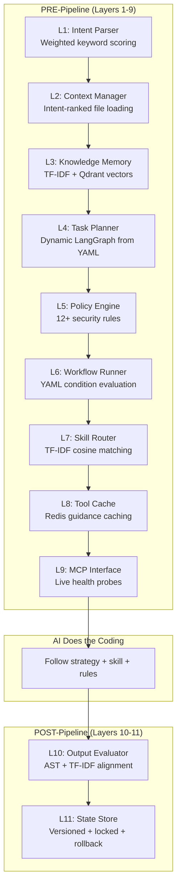

# ⚡ Antigravity Seamless Pipeline

> An 11-layer autonomous intelligence pipeline that makes your AI coding assistant smarter, safer, and faster — before and after every task.


---

## What Is This?

It is a **pre/post-processing pipeline** that wraps around your AI coding assistant. Every time you send an instruction, the pipeline:

1. **Before work** (PRE — Layers 1-9): Classifies your intent, loads relevant files, retrieves semantic memories, plans an execution strategy, enforces security rules, routes to the best skill, checks cache, and verifies server health.

2. **After work** (POST — Layers 10-11): Evaluates the output using AST analysis and TF-IDF alignment, stores task memory in a vector database, and persists versioned state with file locking.

**Result:** Your AI assistant knows what you want, remembers what worked before, follows security rules, and evaluates its own output — automatically.

---

## Key Features

| Feature | Description |
|---------|-------------|
| 🧠 **TF-IDF Semantic Memory** | Retrieves relevant past tasks using character n-gram vectors + 3-strategy recall (cosine, Jaccard, vector) |
| 🌳 **AST Code Analysis** | Parses generated code into abstract syntax trees to measure function count, class count, cyclomatic complexity |
| 📊 **Dynamic YAML Graphs** | Workflow nodes and edges are built dynamically from `code_generation.yaml` — no hardcoded pipelines |
| 🔒 **12+ Security Rules** | Blocks `eval()`, `exec()`, `pickle.loads()`, `dangerouslySetInnerHTML`, and more — with graduated severity scoring |
| 💾 **Versioned State** | State files are backed up before every write, with `fcntl.flock()` file locking and automatic rollback on failure |
| 🏥 **Live Health Probes** | Checks if MCP servers are actually running via `pgrep`, `socket`, and `which` — not just configured |
| 🎯 **52 Skills** | From `auth-implementation-patterns` to `kubernetes-manifests` to `react-performance-optimization` |
| ⚡ **Sub-second execution** | Full 11-layer pipeline completes in ~800ms |

---

## Architecture



---

## Quickstart

### 1. Clone the repository

```bash
git clone https://github.com/shantosaha/Antigravity-Seamless-Pipeline.git
cd Antigravity-Seamless-Pipeline
```

### 2. Install dependencies

```bash
# Create Python virtual environment
python3 -m venv ~/.antigravity/venv
source ~/.antigravity/venv/bin/activate
pip install -r requirements.txt

# Start Docker services (Qdrant + Redis + Postgres)
docker-compose up -d
```

### 3. Install globally

```bash
# Copy the engine to the global location
cp -r . ~/.antigravity/

# Verify the pipeline
python3 run_pipeline.py --mode full --input "test" --code-file run_pipeline.py
```

### 4. Activate in any project

```bash
cd /path/to/your/project
bash ~/.antigravity/activate.sh
```

This creates a `.agent/rules/antigravity_pipeline.md` file in your project with `alwaysApply: true`, which makes the pipeline run **automatically on every task**.

---

## CLI Usage

```bash
source ~/.antigravity/venv/bin/activate

# Pre-execution intelligence (layers 1-9)
python3 run_pipeline.py --mode pre --input "Build a REST API with auth"

# Post-execution evaluation (layers 10-11)
python3 run_pipeline.py --mode post --input "Build a REST API" --code-file app.py

# Full pipeline (all 11 layers)
python3 run_pipeline.py --mode full --input "Build a REST API" --code-file app.py

# JSON output for scripting
python3 run_pipeline.py --mode full --input "test" --json
```

---

## Repository Map

```
├── engine/              → The 11-layer Python brain (2,815 lines)
├── skills/              → 52 skill definitions for the TF-IDF router
├── templates/           → Auto-run rule + workflow templates
│   ├── antigravity_pipeline.md → The alwaysApply rule (installed per-project)
│   └── README.md        → Explains what each template does
├── workflows/           → YAML workflow graphs
├── policy/              → Security rules + policy engine
├── docs/                → Deep documentation
│   ├── INSTALLATION.md  → Step-by-step setup guide
│   ├── ARCHITECTURE.md  → 11-layer technical breakdown
│   ├── USAGE_GUIDE.md   → Auto-run rules, CLI, IDE integration
│   ├── CONFIGURATION.md → All YAML configs explained
│   ├── ADDING_SKILLS.md → How to feed the TF-IDF router
│   ├── ENGINE_CODEBASE.md → Developer walkthrough
│   └── CHANGELOG.md     → P0-P3 upgrade history
├── cache/               → Runtime guidance cache (auto-populated)
├── output/              → Pipeline output (auto-populated)
├── global.yaml          → Global rules configuration
├── docker-compose.yml   → Qdrant + Redis + Postgres
├── activate.sh          → Per-project activation script
└── run_pipeline.py      → CLI entrypoint
```

See the [docs/](docs/) folder for detailed documentation on every component.

---

## Example Pipeline Output

```
═════════════════════════════════════════════════
   ANTIGRAVITY PIPELINE — PRE MODE
═════════════════════════════════════════════════

   Layer  1 │ ✅ │ User Intent
            │    │ → Intent: auth-implementation-patterns (conf: 42%)
            │    │ → Language: javascript
   Layer  4 │ ✅ │ Planner (Dynamic Graph)
            │    │ → Complexity: 55/100 → strategy: conditional
            │    │ → Sub-tasks: 3
   Layer  6 │ ✅ │ Workflow (YAML Conditions)
            │    │ → Nodes: 4 executed, 0 skipped
   Layer  7 │ ✅ │ Skill Router (TF-IDF)
            │    │ → Skill: auth-implementation-patterns (100%)
   Layer  9 │ ✅ │ MCP Servers (Health Probes)
            │    │ → 4 configured, 2 healthy

   PRE RESULT: ✅ ALL PASSED (9/9) | 832ms
═════════════════════════════════════════════════
```

---

## License

This project is licensed under the MIT License — see the [LICENSE](LICENSE) file for details.
