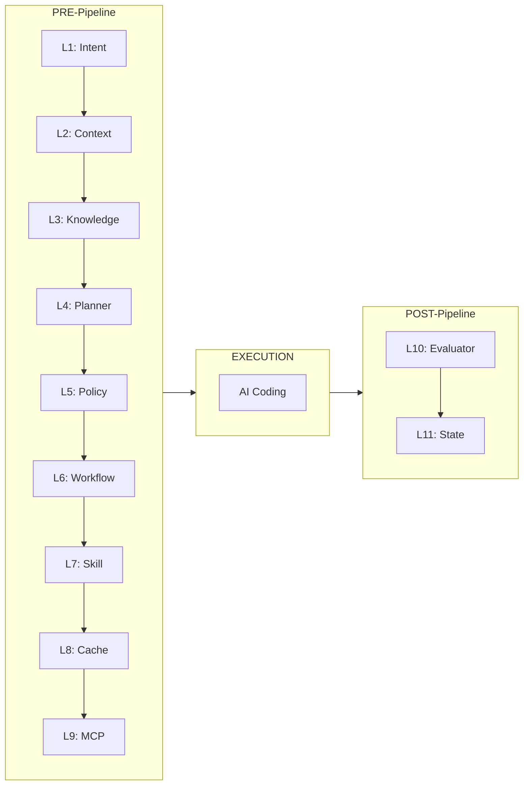

# Architecture

A deep dive into the 11-layer pipeline architecture.

---

## Overview

The Antigravity pipeline is structured in three phases:



| Phase | Layers | Trigger | Duration |
|-------|--------|---------|----------|
| **PRE** | 1-9 | Before any work | ~800ms |
| **WORK** | — | AI does the coding | varies |
| **POST** | 10-11 | After work completes | ~15ms |

---

## Layer-by-Layer Breakdown

### Layer 1: Intent Parser (`ingress.py`)

**Purpose:** Classify the user's instruction into an intent category with a confidence score.

| Input | Output |
|-------|--------|
| Raw user instruction | `intent_type`, `confidence`, `secondary_intent`, `detected_language` |

**How it works:**
- Weighted keyword scoring across intent categories (code, auth, database, design, etc.)
- Language detection via file extension aliases
- Secondary intent detection for multi-domain tasks
- Confidence is a normalized ratio of the top match score vs total

---

### Layer 2: Context Manager (`ingress.py`)

**Purpose:** Load the most relevant project files within a token budget.

| Input | Output |
|-------|--------|
| Intent type, project root | `ranked_files`, `contents_loaded`, `ranking_method` |

**How it works:**
- Scans up to 500 files in the project directory
- Ranks by **intent-weighted relevance** (not just recency)
- Respects a 190,000-token budget
- File content hashes are cached in Redis to avoid re-reading

---

### Layer 3: Knowledge Memory (`ingress.py`)

**Purpose:** Retrieve semantically similar past tasks from Qdrant vector memory.

| Input | Output |
|-------|--------|
| User instruction | `memories_retrieved`, `vectorizer_type`, `sources` |

**How it works:**
- Converts the instruction into a **TF-IDF character n-gram vector** using scikit-learn
- 3-strategy retrieval:
  1. **Vector search** — Qdrant nearest-neighbor lookup
  2. **TF-IDF cosine** — similarity against stored task embeddings
  3. **N-gram Jaccard** — character-level overlap for fuzzy matching
- Falls back to SHA-512 hash vectors if scikit-learn is unavailable

---

### Layer 4: Task Planner (`processing.py`)

**Purpose:** Score complexity, select an execution strategy, and decompose into sub-tasks.

| Input | Output |
|-------|--------|
| Intent, instruction, memories | `complexity_score`, `strategy`, `sub_tasks`, `directives` |

**How it works:**
- **Complexity scoring** (0-100): Weighted analysis of keyword density, file references, technical terms
- **Strategy selection:**
  - `linear` (complexity < 30): Simple sequential execution
  - `parallel` (30-60): Independent sub-tasks that can run concurrently
  - `conditional` (60+): Complex tasks with branching logic
- **Dynamic LangGraph**: Nodes and edges are built from `workflows/code_generation.yaml`

---

### Layer 5: Policy Engine (`processing.py`)

**Purpose:** Enforce security rules and inject context-aware dynamic rules.

| Input | Output |
|-------|--------|
| Code context, intent | `approved`, `violations`, `severity_score`, `dynamic_rules_injected` |

**Hard rules (block immediately):**
- `eval()`, `exec()`, `__import__('os').system`, `subprocess.call`
- `pickle.loads()`, `yaml.load()` (without SafeLoader)
- `dangerouslySetInnerHTML`, `innerHTML =`, `child_process`

**Dynamic rules (injected based on context):**
- `.env` file detected → "Never log environment variables"
- Auth intent → "Use bcrypt for password hashing"
- Database intent → "Use parameterized queries"

---

### Layer 6: Workflow Runner (`processing.py`)

**Purpose:** Execute workflow nodes from YAML, evaluating conditions per node.

| Input | Output |
|-------|--------|
| Workflow YAML, strategy, complexity | `nodes_executed`, `nodes_skipped`, `conditions_evaluated` |

**Condition evaluation:**
| YAML Condition | Maps To | Evaluation |
|----------------|---------|------------|
| `has_design` | complexity < 30 | Skip architecture for simple tasks |
| `needs_design` | complexity ≥ 30 | Include architecture for complex tasks |
| `approved` | evaluator passed | Allow code review loop exit |

---

### Layer 7: Skill Router (`processing.py`)

**Purpose:** Match the best skill using Experience API patterns and TF-IDF cosine similarity.

| Input | Output |
|-------|--------|
| Intent, instruction | `skill_matched`, `confidence`, `secondary_skill`, `instructions_loaded` |

**How it works:**
- **[NEW] Experience API Check:** Queries past successful patterns via the 32-Agent memory store. Overrides static matching if confidence >80%.
- Reads all `SKILL.md` files from the `skills/` directory.
- Builds TF-IDF vectors from skill descriptions + user instruction.
- Returns the highest cosine similarity match.
- Falls back to keyword matching if TF-IDF is unavailable.

---

### Layer 8: Tool Cache (`processing.py`)

**Purpose:** Check Redis for cached guidance from a prior identical task.

| Input | Output |
|-------|--------|
| Normalized task key | `cache_hit`, `cached_guidance` |

**Cache key normalization:** lowercase, strip whitespace, sort words — so "Build a REST API" and "build a rest api" hit the same cache. TTL: 24 hours.

---

### Layer 9: MCP Interface (`egress.py`)

**Purpose:** Check which MCP servers are available and healthy.

| Input | Output |
|-------|--------|
| MCP config YAML | `servers_configured`, `servers_healthy`, `health_status` |

**3-strategy health probes:**
1. `pgrep -f <command>` — Is the process running?
2. `socket.connect_ex(host, port)` — Is the port open?
3. `shutil.which(binary)` — Is the binary installed?

---

### Layer 10: Output Evaluator (`egress.py`)

**Purpose:** Score the quality of the generated output.

| Input | Output |
|-------|--------|
| Code file, original instruction | `overall_score`, `passed`, `safety`, `intent_alignment` |

**Scoring components:**
- **Safety** (40%): Pattern scanning for banned functions + graduated severity
- **Intent alignment** (30%): TF-IDF cosine similarity between instruction and output
- **Structure** (30%): AST analysis — function count, class count, cyclomatic complexity

---

### Layer 11: State Store (`egress.py`)

**Purpose:** Persist task history, store memory in Qdrant, log telemetry to Redis, and train the Experience API.

| Input | Output |
|-------|--------|
| All layer results | `state_version`, `versions_kept`, `trends`, `qdrant_stored`, `redis_stored` |

**Features:**
- **[NEW] Experience API Training:** Records task success, skill used, and evaluation score back to the 32-Agent learning model.
- **Versioned state**: Creates `state_v{N}.json` backup before each write (keeps last 3).
- **File locking**: `fcntl.flock()` exclusive lock prevents concurrent corruption.
- **Rollback**: Automatic restore from latest backup if write fails.
- **Trend analysis**: Tracks average score, improvement rate, most used skill.

---

## Optimization Tiers

| Tier | Focus | Key Upgrades |
|------|-------|-------------|
| **P0** | Infrastructure | Singleton services, parallel L2/L3, circuit breaker, guidance caching |
| **P1** | Core Logic | Weighted intent scoring, complexity analysis, multi-skill routing |
| **P2** | Intelligence | TF-IDF semantic vectors, cosine matching, AST code analysis |
| **P3** | Polish | Dynamic YAML graphs, condition evaluation, health probes, versioned state |

---

## Module Layout

```
engine/
├── __init__.py       → Layer registry (maps layer numbers to classes)
├── ingress.py        → Layers 1-3 (input processing)
│   ├── IntentParser
│   ├── ContextManager
│   └── KnowledgeRetrieval
├── processing.py     → Layers 4-8 (planning & routing)
│   ├── TaskPlanner
│   ├── PolicyEngine
│   ├── WorkflowRunner
│   ├── SkillRouter
│   └── ToolCache
├── egress.py         → Layers 9-11 (output & persistence)
│   ├── MCPInterface
│   ├── OutputEvaluator
│   └── StateManager
└── orchestrator.py   → Pipeline orchestrator
    ├── PipelineOrchestrator
    ├── ServiceSingleton (Qdrant, Redis connections)
    └── CircuitBreaker
```
